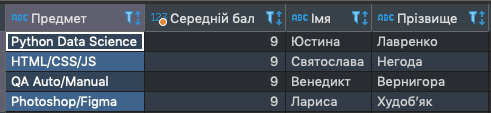

# Select Data 


**1) 5 студентів із найбільшим середнім балом з усіх предметів**
```
SELECT round(AVG(m.mark)) as Середній_бал, s.first_name Імя, s.last_name  Прізвище
FROM marks m
LEFT JOIN students s ON m.student_id = s.id
GROUP BY m.student_id
ORDER BY AVG(m.mark) DESC
LIMIT 5;
```


**2) студент із найвищим середнім балом з одного предмета**
```
SELECT sub.subject as Предмет, round(avg(m.mark)) as 'Середній бал', s.first_name Імя, s.last_name  Прізвище
FROM marks m
JOIN students s ON m.student_id = s.id
JOIN subjects sub ON m.subject_id = sub.id 
GROUP BY m.subject_id 
ORDER BY sub.id;
```


**3) середній бал в групі по одному предмету**
```
SELECT CEIL(avg(m.mark)) as 'Середній бал', s.subject 'Предмет' 
FROM marks m
JOIN subjects s ON m.subject_id = s.id 
GROUP BY s.id;
```


**4) Середній бал у потоці**
```
SELECT FLOOR(AVG(m.mark)) as 'Середній бал в потоці'
FROM marks m;
```


**5) Які курси читає викладач**
```
select t.first_name, t.last_name, s.subject
from teachers t
Join subjects s On s.teacher_id = t.id;
```


**6) Список студентів у групі**
```
SELECT s.id as ID, s.first_name as Імя, s.last_name as Прізвище, g.title as 'Назва групи'
FROM students s 
JOIN groups g ON g.id = s.group_id 
WHERE  g.title = 'Перша';
```


**7) Оцінки студентів у групі з предмета**
```
SELECT s.first_name as Імя, s.last_name as Прізвище, m.mark as Оцінки, g.title as Група, sub.subject as Предмет
FROM students s
JOIN marks m ON m.student_id = s.id 
JOIN groups g ON s.group_id = g.id 
JOIN subjects sub ON m.subject_id  = sub.id 
WHERE s.group_id = 2 and m.subject_id = 1
ORDER BY m.mark DESC;
```


**8) Оцінки студентів у групі з предмета на останньому занятті**
```
SELECT max(m.lesson_date) as 'Дата заннятя', s.first_name as Імя, s.last_name as Прізвище, g.title as Група, sub.subject as Предмет
FROM marks m
LEFT JOIN students as s ON s.id = m.student_id
LEFT JOIN groups g ON g.id = s.group_id 
LEFT JOIN subjects sub ON sub.id = m.subject_id 
WHERE m.subject_id = 2 and g.id = 3;
```


**9) Список курсів, які відвідує студент**
```
SELECT DISTINCT s.id as ID, s.first_name as Імя, s.last_name as Прізвище,  sub.subject as Предмет
FROM students s 
JOIN marks m ON m.student_id  = s.id 
JOIN subjects sub ON sub.id = m.subject_id 
WHERE s.id = 8;
```


**10) Список курсів, які студенту читає викладач**
```
SELECT DISTINCT s.id as ID, s.first_name as Імя, s.last_name as Прізвище,  sub.subject as Предмет, t.last_name as 'Прізвище викладачa'
FROM students s 
JOIN marks m ON m.student_id  = s.id 
JOIN subjects sub ON sub.id = m.subject_id 
JOIN teachers t ON m.teacher_id = t.id 
WHERE s.id = 18 and t.id = 2;
```


**11) Середній бал, який викладач ставить студенту**
```
SELECT round(avg(m.mark)) as 'Середній бал' ,s.first_name 'Імя студента', s.last_name 'Прізвище студента' 
FROM students s 
JOIN marks m ON m.student_id = s.id 
JOIN teachers t ON t.id = m.teacher_id
WHERE s.id = 22;
```


**12) Середній бал, який ставить викладач**
```
SELECT ROUND(AVG(m.mark))  as 'Середній бал' , t.first_name 'Імя викладача', t.last_name 'Прізвище викладача'
FROM teachers t
JOIN marks m  ON teacher_id = m.teacher_id 
WHERE  t.id = 2;
```

