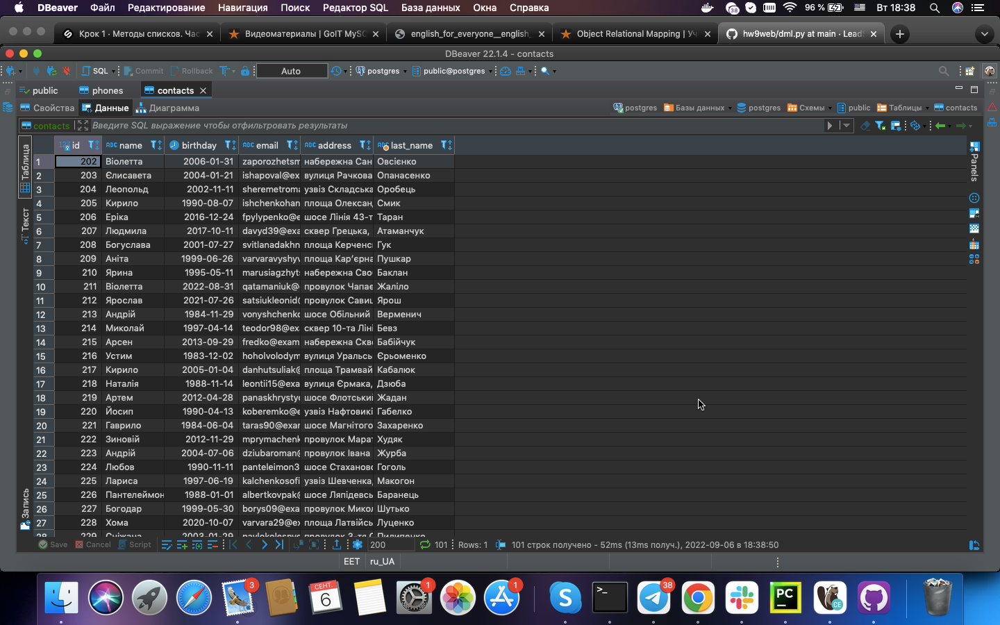
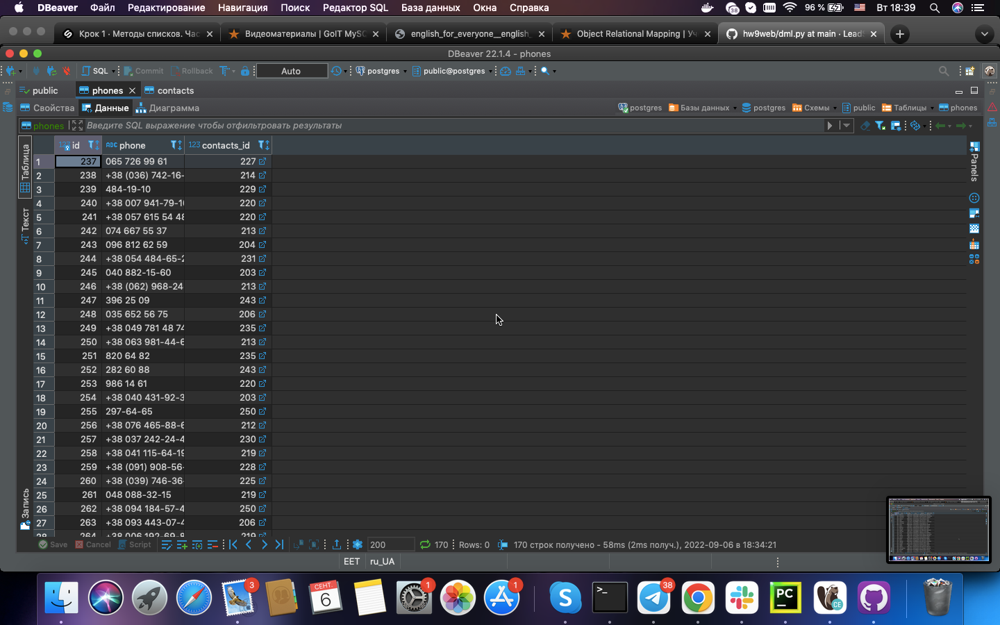
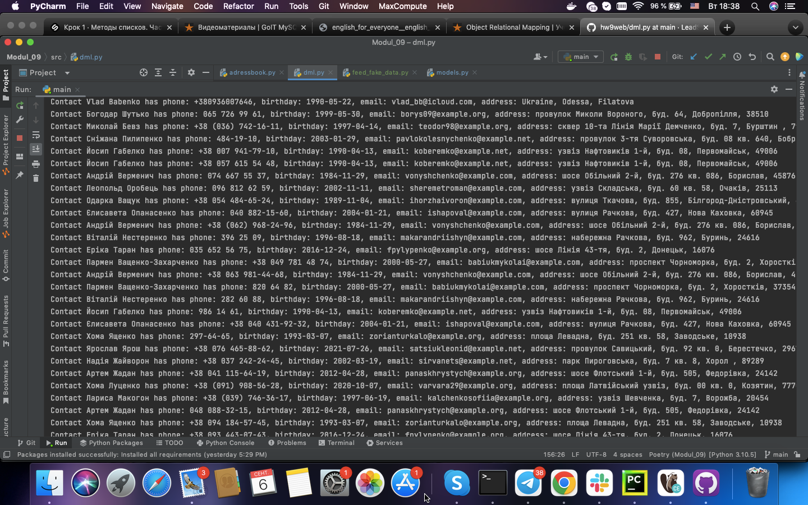

# HomeWork 9
**Реалізуйте зберігання інформації для вашого "Персонального помічника" в базі даних PostgreSQL.**

**Реалізуйте зберігання книги контактів з email адресами, телефонами, іменами в базі даних.**

**Критерії приймання**
- база даних описується за допомогою SQLAlchemy моделей;
- таблиці в базі даних створюються та змінюються за допомогою Alembic;
- пошук необхідної інформації відбувається за допомогою запитів до бази даних;

*Contact table*

*Phones Table*

*Output*
